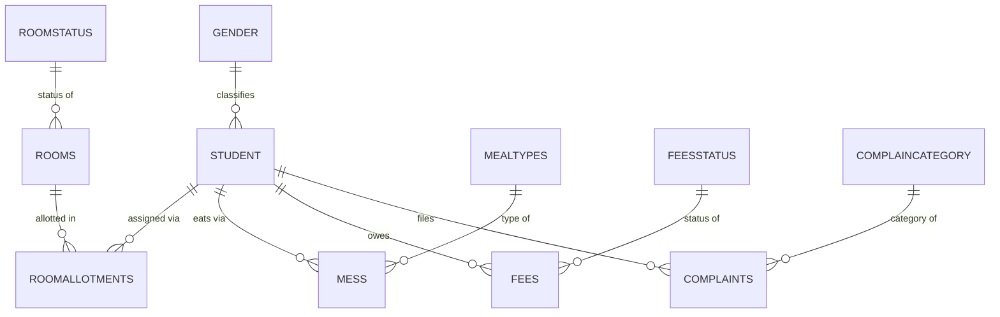

# Hostel Management System — Relational Database Design

A normalized relational database that replaces scattered paper/spreadsheet records
for a student hostel with a single, integrity-enforced system covering students,
room allotments, fees, complaints, and mess (meal) tracking. Designed from an
entity-relationship model and implemented in **Microsoft Access** with forms,
reports, validation, and light automation.

Built as the final project for **ISM6216 – Database Management & Warehousing**
(M.S. Data Analytics for Business, Seattle Pacific University).

## What it does
- Stores all hostel data in one place instead of separate, hard-to-reconcile records.
- Automates **room allocation** with real-time availability and accurate records.
- Tracks **fee payments**, due dates, overdue balances, and outstanding totals.
- Lets students **file complaints** and lets admins track Pending vs. Resolved status.
- Records **mess/meal** activity by meal type.
- Generates **reports** for occupancy, fee collection, and complaint resolution to
  support decision-making.

## Data model
Eleven tables, normalized with dedicated lookup/status tables to reduce redundancy
and enforce consistency. `Student` is the central entity; every transactional table
references it by foreign key, with full primary-key, entity, and referential-integrity
constraints.

### Tables (schema)
**Core entities**
- `Student(StudentID PK, FName, LName, GID FK→Gender, Age, ContactNo, Address)`
- `Rooms(RoomID PK, RoomType, Capacity, NoOfCurrentStudentAllocated, RSID FK→RoomStatus)`
- `RoomAllotments(AllotmentID PK, StudentID FK→Student, RoomID FK→Rooms, DateAllotted)`
- `Fees(FeeID PK, StudentID FK→Student, Amount, DueDate, PaymentDate, FSID FK→FeesStatus)`
- `Complaints(ComplaintID PK, StudentID FK→Student, Complaint, ComplaintDate, CID FK→ComplainCategory)`
- `Mess(MessID PK, StudentID FK→Student, MTID FK→MealTypes, MealDate)`

**Lookup / status tables (normalization)**
- `Gender(GID PK, Gender)`
- `RoomStatus(RSID PK, StatusName)`
- `FeesStatus(FSID PK, Situation)`
- `ComplainCategory(CID PK, ComplainCategory)`
- `MealTypes(MTID PK, MealName)`

## Application layer (forms & reports)
**Forms**
- **Navigation dashboard** — default launch screen; buttons/macros route to each form.
- **Student Registration** — data entry with a gender list box and a per-student print report.
- **Fee Payment** — combo-box fee status, calculates totals, flags overdue/pending.
- **Complaint** — Pending and Resolved subforms, each with its own print-report button.

**Reports**
- **Pending Complaints** / **Resolved Complaints** — linked to the complaint form.
- **Fees Payment** — lists overdue/pending balances with a grand total of outstanding
  fees and a chart summarizing overall fee status (paid / pending / overdue).
- **Student Hostel Detail** — per-student view joining allotment, room, and mess data.

**Data integrity & automation**
- Domain, entity, and referential-integrity constraints across all tables.
- Field validation (e.g., contact number) to keep data clean on entry.
- Overdue-fee alerts and automatic complaint-status handling.

## Skills demonstrated
ER modeling · relational schema design · normalization · primary/foreign keys ·
referential integrity · lookup tables · forms & reports · query design · data validation.

## Files in this repo
- `ER-Diagram` — the entity-relationship diagram.
- `*.accdb` — the Microsoft Access database (tables, forms, reports, macros).
- Project report (`.pdf` / `.docx`) — full design write-up.

## Limitations & next steps
This was a focused course project; performance was tuned for modest data volumes.
Natural extensions: add indexing and query optimization for larger datasets, and
move logic into stored procedures/triggers (or port the schema to a server database
such as PostgreSQL) for production-scale use.
